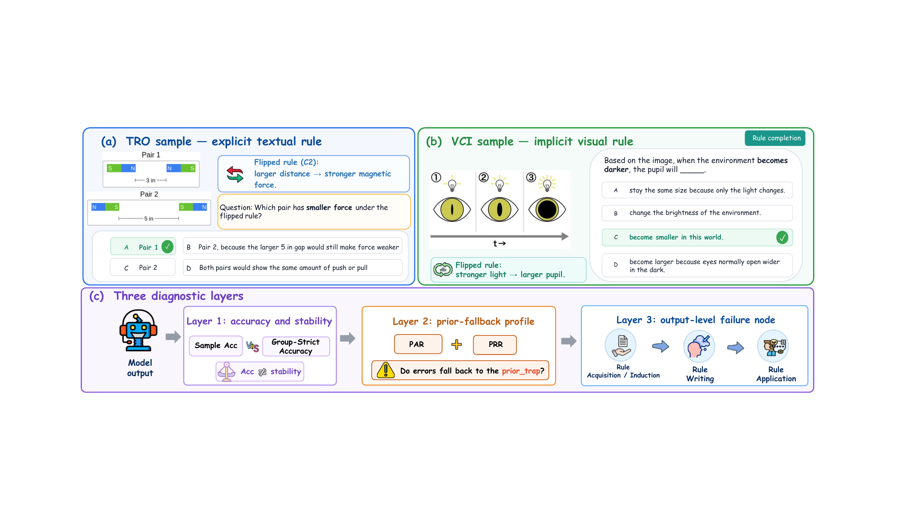

<<<<<<< HEAD
# CausalConflictBench

**CausalConflictBench: Can Multimodal Models Follow Local Mechanisms That Conflict with Commonsense?**

CausalConflictBench is a benchmark for diagnosing whether multimodal models can follow the **local mechanism** specified in the current sample when it conflicts with a **commonsense prior**. It is not mainly about how many ordinary science VQA questions a model can answer correctly. Instead, it asks whether the model executes the mechanism given in the current item, or falls back to the factual-prior answer when the stated mechanism contradicts real-world commonsense.

<p align="center">
  
</p>

## What This Benchmark Measures

In many multimodal reasoning benchmarks, the mechanism in the question is usually consistent with real-world commonsense. When a model answers correctly, it is difficult to tell whether it truly understood and applied the mechanism in the current sample, or simply retrieved parameterized commonsense. CausalConflictBench makes this ambiguity explicit: each sample creates a conflict between the current cause-to-effect mechanism and the default commonsense mechanism, and separately annotates the target answer and the factual-prior answer.

The repository is therefore designed to answer three questions:

- Can a model produce the correct answer under the current mechanism for an individual sample?
- Can a model consistently apply the same mechanism across multiple related variants of the same source question or visual variant?
- When a model fails, do its errors concentrate on the real-world commonsense answer rather than on ordinary distractors?

## Benchmark Components

| Component | Full name | How the mechanism is provided | Main diagnostic focus | Scale |
| --- | --- | --- | --- | --- |
| `TRO` | Textual Rule Override | An explicit textual override rule is provided on top of ScienceQA natural-science image questions | Whether the model can read, state, and consistently apply a counter-commonsense textual rule | 3,651 images, 8,944 mechanism-conflict samples |
| `VCI` | Visual Counter-Commonsense Induction | A three-frame visual sequence demonstrates a counter-commonsense mechanism without directly stating the rule direction in text | Whether the model can induce a counter-commonsense rule from the visual sequence and transfer it to new questions | 150 mechanisms, 740 visual variants, 2,960 transfer samples |

`TRO` and `VCI` are not text and image versions of the same set of mechanisms. They are two complementary tracks under the same diagnostic framework: `TRO` observes explicit textual rule delivery, while `VCI` observes visual rule induction.

## Repository Structure

```text
CausalConflictBench/
├── data/
│   ├── scienceqa/
│   │   ├── problems_tro.json
│   │   └── images/              # ScienceQA images; download separately
│   └── VCI/
│       ├── shuffled_no_because/
│       └── exclude_samples.json
├── models/
│   ├── inference_api.py
│   ├── run_inference.py
│   └── base_prompt.py
├── testCausal/
│   └── run_stage3_conflict_eval.py
├── test_visual_causal/
│   ├── run_vci_eval.py
│   └── run_vci_cot_analysis.py
└── assets/
    └── readme/
        └── overview.png
```

## Data Entry Points

### TRO

The main `TRO` data file is:

```text
data/scienceqa/problems_tro.json
```

The ScienceQA images used by `TRO` are not included in this repository. The image data can be downloaded from the ScienceQA dataset on Hugging Face:

```text
https://huggingface.co/datasets/derek-thomas/ScienceQA
```

After downloading, place the images under the following directory. The evaluation scripts read from this location by default:

```text
data/scienceqa/images/
```

`TRO` samples are derived from ScienceQA natural-science image questions. Each conflict sample records the current textual override rule, the conflict question, the answer options, the target answer, and the factual-prior answer. During evaluation, you can switch between multimodal and text-only conditions, and you can also use the CA-CoT mode for rule-writing diagnostics.

### VCI

The `VCI` question files are located by default at:

```text
data/VCI/shuffled_no_because/
```

The three-frame visual sequences used by `VCI` are not included in this repository. The image data can be downloaded from the CausalConflictBench dataset on Hugging Face:

```text
https://huggingface.co/datasets/anonymous-submission1012/CausalConflictBench
```

After downloading, place the images under the following directory. The evaluation scripts read from this location by default:

```text
data/VCI/synthetic_image/
```

`VCI` links questions and images through `domain + variant_id`. Each visual variant produces four types of transfer questions: `object substitution`, `reverse scene`, `rule completion`, and `parameter extrapolation`.

## Environment and Dependencies

The main evaluation entry points, `testCausal/run_stage3_conflict_eval.py` and `test_visual_causal/run_vci_eval.py`, rely only on the Python standard library for API requests, JSON / JSONL I/O, and CSV report generation. They do not require `openai`, `requests`, `numpy`, or `pandas`.

If you use `models/llava_onevision_openai_server.py` to start a local multimodal adapter server, install the optional dependencies:

```powershell
pip install -r requirements.txt
```

If you use `testCausal/start_qwen_vl_vllm.sh` to start a vLLM service, install and configure the `vllm` executable separately in your runtime environment. This dependency is not included in the general `requirements.txt`.

## Quick Start

Set the API key before running evaluation. The interface can use the OpenAI Responses API, or a local or third-party compatible endpoint.

```powershell
$env:OPENAI_API_KEY="<API_KEY_PLACEHOLDER>"
```

`TRO` uses the original images for multimodal evaluation by default and does not require `data/captions.json`. To run a text-only caption ablation, pass a caption file explicitly with `--captions_file <path-to-caption-json>`.

### TRO Dry Run

Check the prompt and payload without sending real requests:

```powershell
python -m testCausal.run_stage3_conflict_eval `
  --data_file data/scienceqa/problems_tro.json `
  --image_root data/scienceqa/images `
  --split all `
  --limit 1 `
  --task_variant conflict `
  --prompt_mode answer_only_extractable `
  --model gpt-5.4 `
  --endpoint_type responses `
  --dry_run
```

### TRO Small-Sample Evaluation

```powershell
python -m testCausal.run_stage3_conflict_eval `
  --data_file data/scienceqa/problems_tro.json `
  --image_root data/scienceqa/images `
  --split all `
  --limit 20 `
  --task_variant conflict `
  --prompt_mode answer_only_extractable `
  --model gpt-5.4 `
  --endpoint_type responses `
  --label tro_smoke `
  --stream
```

### VCI Dry Run

```powershell
python -m test_visual_causal.run_vci_eval `
  --limit 1 `
  --question_subdir shuffled_no_because `
  --prompt_mode answer_only_extractable `
  --dry_run
```

### VCI Small-Sample Evaluation

```powershell
python -m test_visual_causal.run_vci_eval `
  --model gpt-5.4 `
  --endpoint_type responses `
  --question_subdir shuffled_no_because `
  --prompt_mode answer_only_extractable `
  --exclude_json data/VCI/exclude_samples.json `
  --limit 20 `
  --label vci_smoke `
  --stream
```

## Main Evaluation Metrics

CausalConflictBench reports more than sample-level accuracy. The paper and scripts organize results around three layers of diagnostic signal.

| Metric | Meaning |
| --- | --- |
| `Acc` | Sample-level accuracy; checks whether the model gives the target answer under the current mechanism |
| `Group-Strict Accuracy` | Group-level strict accuracy; qid-Acc in `TRO` and Variant Strict Acc in `VCI` |
| `PAR` | Prior-Answer Rate; the proportion of incorrect samples whose answer falls on the factual-prior answer |
| `PRR` | Prior-Response Rate; the proportion of all parseable outputs that produce the factual-prior answer |
| `RW-CoT quadrants` | In `TRO`, output categories defined by whether the model states the override rule and whether the final answer is correct |
| `rule-source labels` | In `VCI`, labels that judge whether the rule induced by the model comes from `flipped`, `factual`, or `other` sources |

These metrics further decompose the broad observation that a model answered incorrectly into more observable failure structures: whether the model failed to apply the mechanism consistently, whether errors concentrated on real-world commonsense, or whether different failures appeared across rule reading, rule writing, and rule application.

## Output Files

`TRO` evaluation usually writes outputs to `results/stage3_conflict_eval/<model>/<label>/`. Common files include:

```text
predictions.jsonl
summary.json
run_config.json
preflight_report.json
metrics_by_split.csv
metrics_by_topic.csv
metrics_by_category.csv
metrics_by_conflict_intensity.csv
error_cases.jsonl
baseline_bias_cases.jsonl
report.md
```

`VCI` evaluation usually writes outputs to `vci_results/<model>/<label>/`. Common files include:

```text
predictions.jsonl
summary.json
run_config.json
preflight_report.json
metrics_by_domain.csv
metrics_by_transfer_type.csv
metrics_by_variant_id.csv
metrics_by_answer_prior.csv
error_cases.jsonl
report.md
```

## Scope and Limitations

CausalConflictBench focuses on the local cause-to-effect rule provided or demonstrated within the current sample. Here, `mechanism` is an operational definition; it is not equivalent to full causal discovery, causal effect estimation, or Pearl-style counterfactual querying.

This setup has the following boundaries:

- `TRO` inherits the source distribution, question types, and image distribution of ScienceQA.
- `VCI` mainly covers visualizable, monotonic, and reversible local mechanisms. It does not cover real videos, open-world experimental images, or non-monotonic mechanisms.
- Process-diagnostic labels are derived from model output text and judge rubrics. They should be interpreted as output-level behavioral labels, not as direct evidence of the model's internal reasoning trajectory.
- Multiple-choice format, option order, and LLM-as-judge decisions may all affect measurement. Evaluation should therefore preserve a fixed parsing protocol, randomized option positions, and semantic option-role annotations.

## License and Provenance

This repository provides CausalConflictBench question files, evaluation scripts, construction scripts, and prompts. The ScienceQA images required by `TRO` and the three-frame visual sequences required by `VCI` are obtained through external data pages. The source and licensing boundaries of each asset type are listed below.

| Asset | Access location | Source / description | Licensing boundary |
| --- | --- | --- | --- |
| ScienceQA images | `https://huggingface.co/datasets/derek-thomas/ScienceQA` | Original ScienceQA images used by `TRO` | Governed by the original ScienceQA license |
| TRO question / rule / option files | This repository: `data/scienceqa/problems_tro.json` | Conflict questions, textual override rules, and option roles derived from ScienceQA natural-science image questions | When used together with ScienceQA-derived items, the corresponding derived-data constraints should be preserved |
| VCI visual sequences | `https://huggingface.co/datasets/anonymous-submission1012/CausalConflictBench` | Three-frame visual sequences used for VCI visual rule induction | Governed by the VCI visual-asset terms on that data page |
| VCI question / option files | This repository: `data/VCI/shuffled_no_because/` | VCI transfer questions, semantic option roles, and metadata | Governed by the VCI text-asset terms in the repository license / provenance files |
| Scripts and prompts | This repository: `models/`, `testCausal/`, `test_visual_causal/` | Evaluation, construction, and diagnostic scripts | Governed by the code and prompt terms in the repository license file |
=======
# CausalConflictBench
>>>>>>> bcc2a5060fb1e6b5101d2a39541f52bee1400c89
